# Mermaid Syntax Reference

Read this file before generating any diagram. It contains syntax examples for every supported
diagram type. Use these as templates — adapt to the actual code you've researched.

## Table of Contents

1. [Sequence](#sequence)
2. [Class](#class)
3. [ERD](#erd)
4. [State](#state)
5. [Flowchart](#flowchart)
6. [Activity](#activity)
7. [Component](#component)
8. [Deployment](#deployment)
9. [Data Flow](#data-flow)
10. [Mind Map](#mind-map)
11. [Timeline](#timeline)
12. [Git Graph](#git-graph)
13. [Block](#block)
14. [Sankey](#sankey)
15. [Packet](#packet)
16. [Architecture](#architecture)

---

## Sequence

Shows call/message flow between components over time.

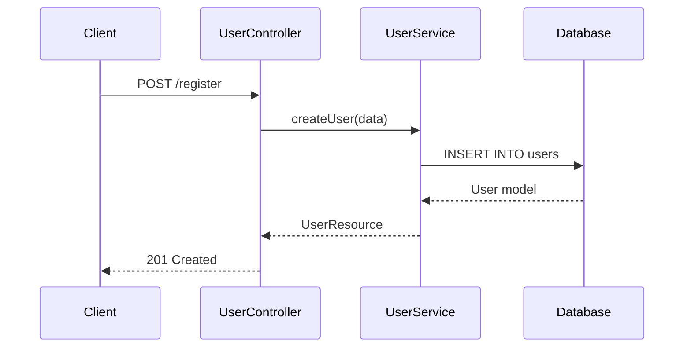

Tips: use `-->>` for responses, `alt`/`else` blocks for branching, `loop` for repetition,
`note over` for annotations, `activate`/`deactivate` for lifelines.

## Class

Shows classes, properties, methods, and relationships.

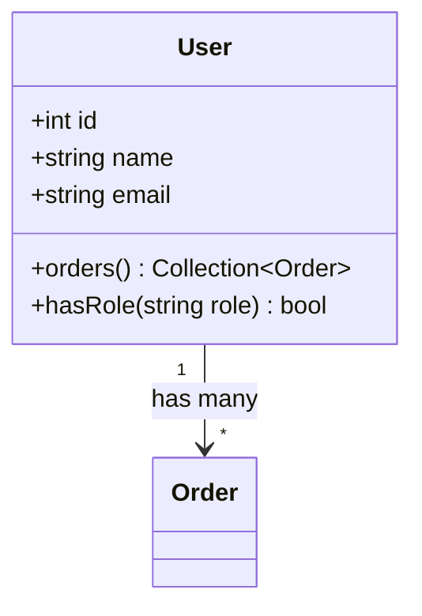

Tips: use `+` public, `-` private, `#` protected, `~` package. Relationship arrows:
`<|--` inheritance, `*--` composition, `o--` aggregation, `-->` association, `..>` dependency.

## ERD

Shows database tables, columns, and relationships.

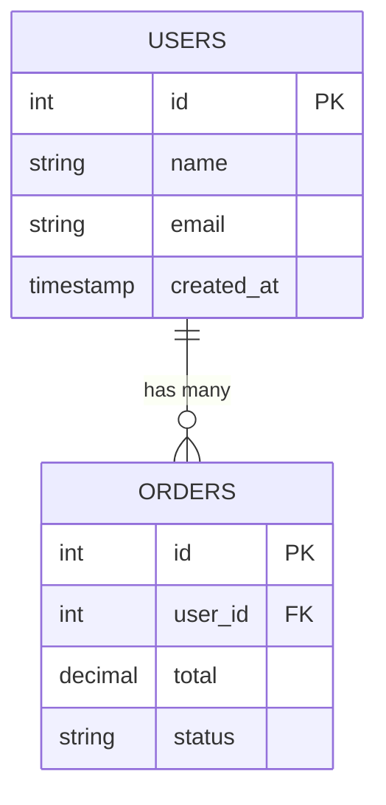

Tips: relationship notation — `||` exactly one, `o|` zero or one, `}|` one or more,
`}o` zero or more. Read left to right.

## State

Shows states an entity goes through and transitions.

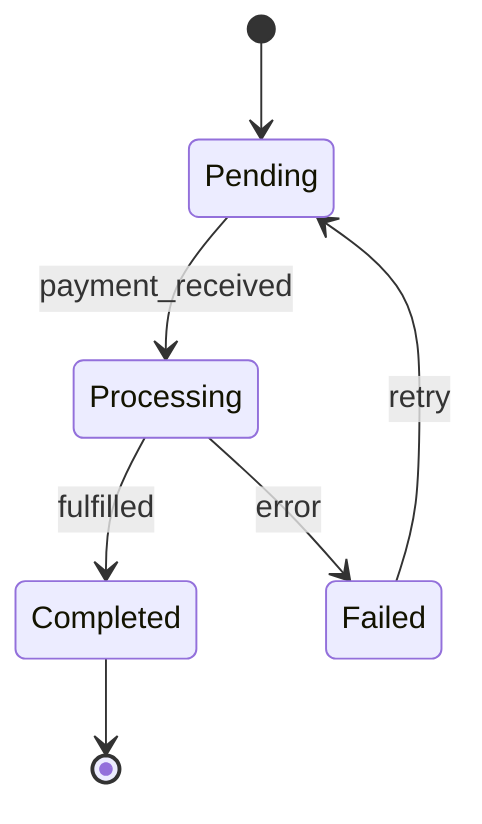

Tips: use `state "Long Name" as s1` for aliases, `state fork_state <<fork>>` for parallel,
`state if_state <<choice>>` for decisions, nested states with `state ParentState { }`.

## Flowchart

Shows decision logic, branching, and process steps.

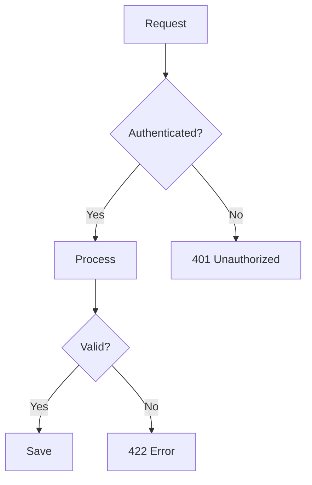

Tips: `TD` top-down, `LR` left-right. Node shapes: `[rect]`, `(round)`, `{diamond}`,
`([stadium])`, `[[subroutine]]`, `[(cylinder)]`, `((circle))`, `>flag]`.

## Activity

Uses flowchart with swimlanes (subgraphs) to show parallel/branching workflows.

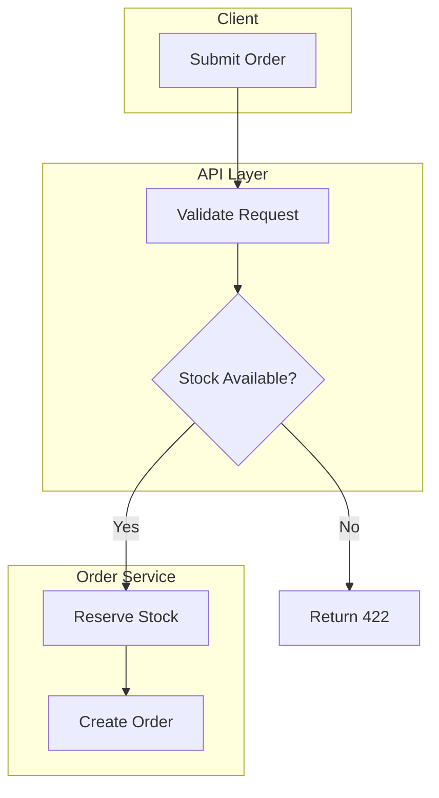

## Component

High-level system architecture using flowchart with subgraphs.

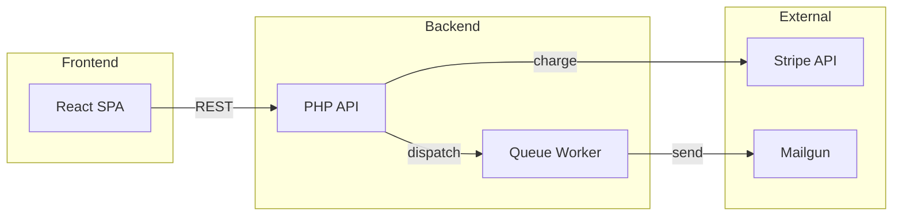

## Deployment

Infrastructure and container layout using flowchart.

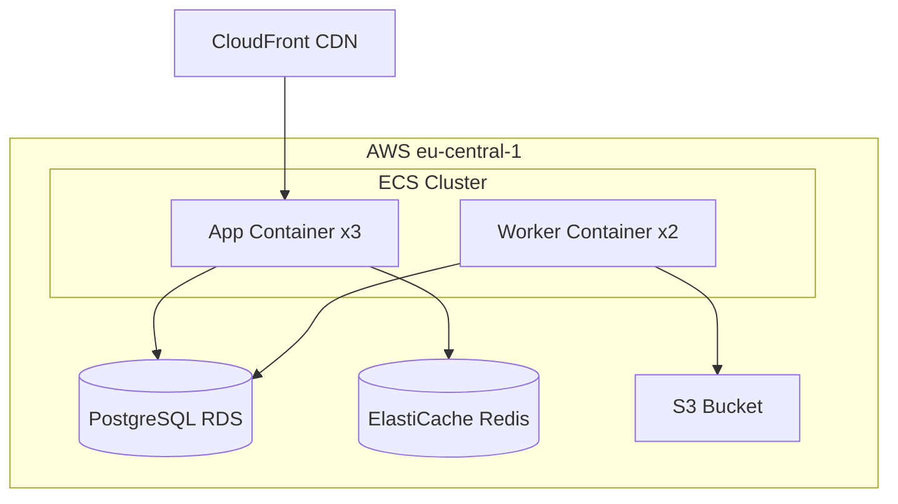

## Data Flow

How data moves between processes and stores (uses flowchart).

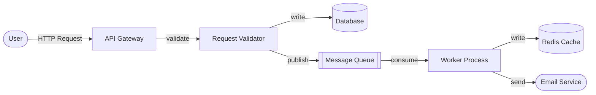

## Mind Map

Hierarchical exploration of a concept or subsystem.

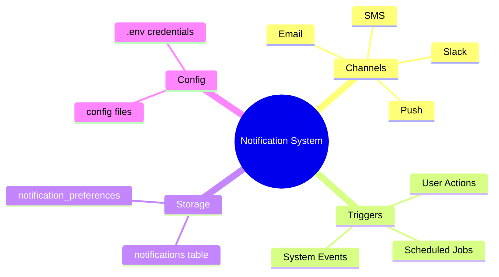

## Timeline

Chronological view of events, phases, or lifecycle.

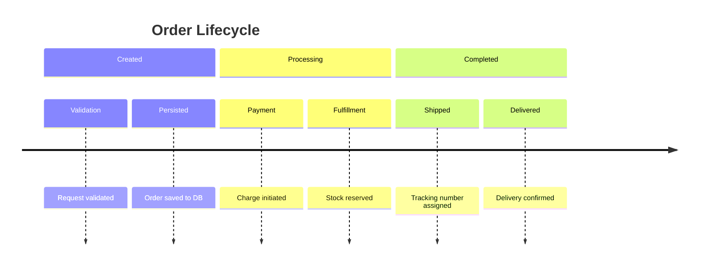

## Git Graph

Branching strategies, release flows, merge patterns.

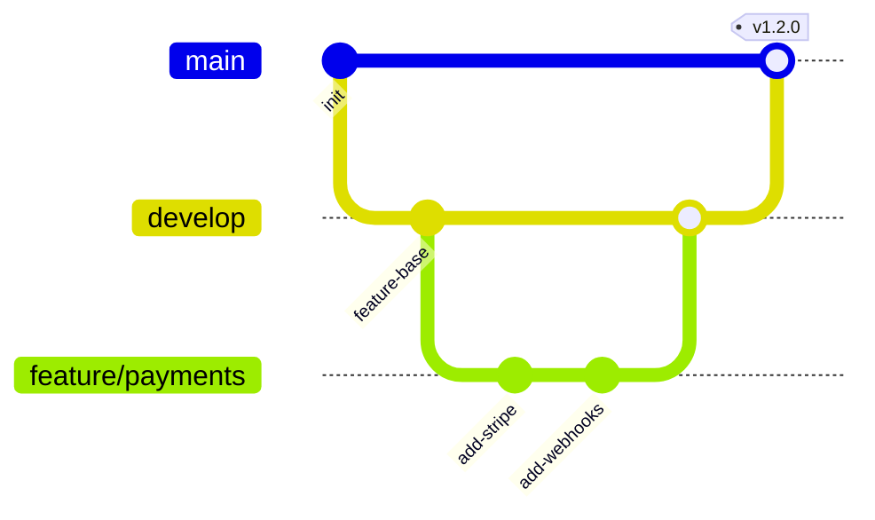

## Block

Nested grouping for architecture layers, modules, or bounded contexts.

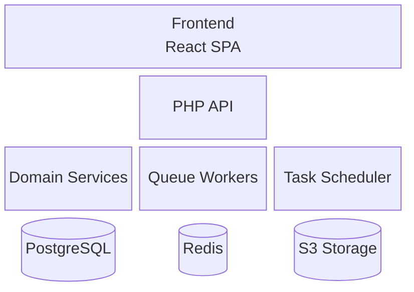

## Sankey

Weighted flow between nodes (request routing, pipeline throughput).

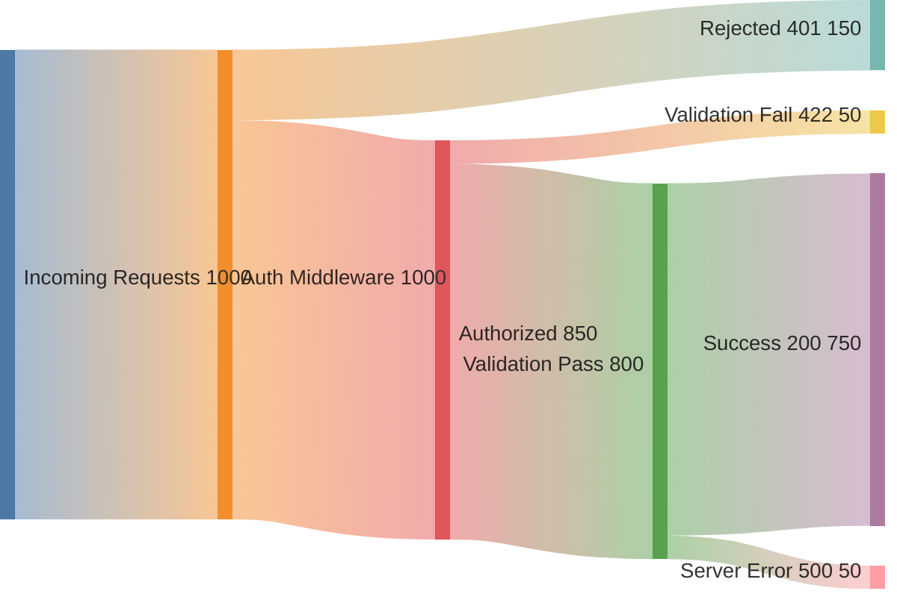

## Packet

Protocol or message/payload structure breakdown.

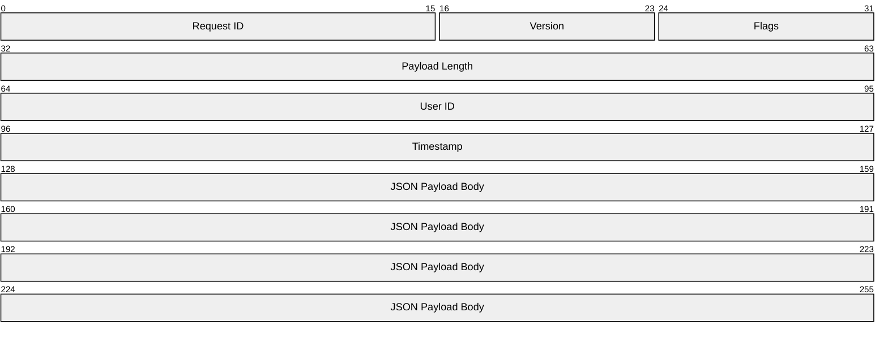

## Architecture

Cloud/infra architecture (C4-style using flowchart).

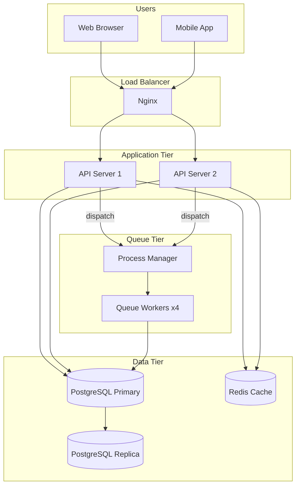

## Applying Mermaid Theme

If config has `mermaid.theme` set to something other than `default`, prepend this frontmatter
to every diagram:

```
---
config:
  theme: {theme_value}
---
```

Place it right after the opening ` ```mermaid ` line, before the diagram type keyword.